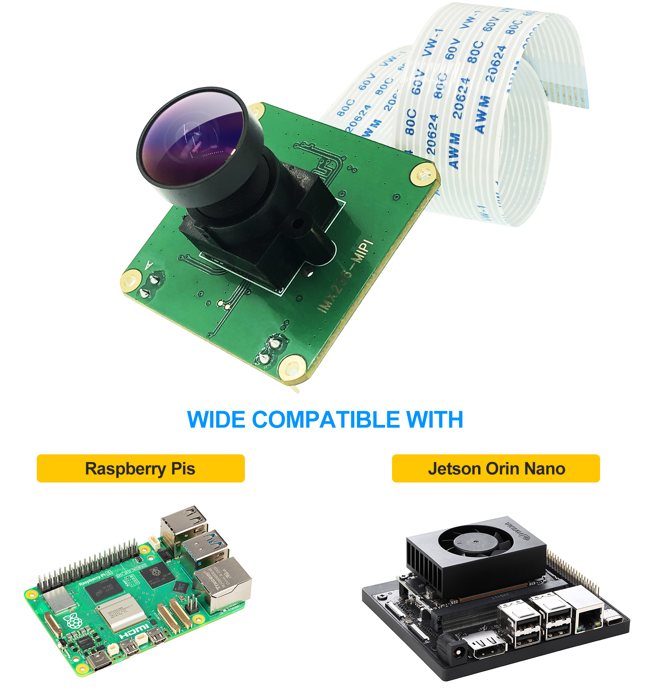

# CAM-IMX296Mono-GS / CAM-IMX296Color-GS Camera Module



**Raspberry Pi Global Shutter Camera**  
**Support Hardware Trigger and Strobe**  
**With Sony IMX296 Mono/Color Sensor**

The **CAM-IMX296Mono-GS** and **CAM-IMX296Color-GS** are professional-grade global shutter camera modules featuring the **Sony IMX296** CMOS sensor. The **Mono** variant (IMX296LLR) provides monochrome imaging without color filter, while the **Color** variant (IMX296LQR) includes a fixed color filter array. Both are designed for high-speed motion capture, automation, and machine vision applications where rolling shutter distortion must be eliminated.

These modules are fully compatible with Raspberry Pi (3, 4, 5) and NVIDIA Jetson Orin Nano. Both platforms support up to 60fps at 1456×1088 resolution and exposure times as short as 30μs. Advanced features like hardware trigger and strobe synchronization are currently available on Raspberry Pi only (Not supported on Jetson Orin Nano currently). These capabilities make them ideal for high-speed photography and demanding imaging applications.

---

## Key Features

*   **1.58MP Global Shutter Sensor**: 1456 × 1088 resolution with 3.4μm × 3.4μm pixel size
*   **Global Shutter**: Eliminates motion blur and rolling shutter distortion in high-speed applications
*   **High Frame Rate**: Support up to 60fps@1456×1088, with exposure times down to 30μs
*   **Mono & Color Variants**: 
    - **CAM-IMX296Mono-GS** (IMX296LLR) - No color filter for maximum sensitivity
    - **CAM-IMX296Color-GS** (IMX296LQR) - Fixed color filter array for RGB imaging
*   **Hardware Trigger & Strobe**: Dedicated pins for external trigger input and strobe output (Raspberry Pi only; Not supported on Jetson Orin Nano currently)
*   **Low Power Consumption**: Operates with analog 3.3V, digital 1.2V, and interface 1.8V triple power supply
*   **High Sensitivity**: Low dark current and low PLS characteristics for excellent low-light performance
*   **Broad Compatibility**: Supports Raspberry Pi 3, 4, and 5 (Debian Bookworm/Trixie) and NVIDIA Jetson Orin Nano
*   **Native Driver Support**: Works directly with official kernel drivers for both platforms
*   **Flexible Lens Options**: Support M12 and CS lens mounts with included lens holder and adapter

---

## Quick Start Guide — Raspberry Pi

### 1. Hardware Connection

Connect the camera to the CSI port of your Raspberry Pi using the appropriate ribbon cable. Ensure the connection is secure.

### 2. Enable the Driver

Modify the Raspberry Pi configuration file to enable the IMX296 overlay.

*   **For older OS versions**:
    ```bash
    sudo nano /boot/config.txt
    ```
*   **For the latest OS (Bookworm/Trixie)**:
    ```bash
    sudo nano /boot/firmware/config.txt
    ```

Add one of the following lines to the end of the file:

**For CAM0 port**:
```ini
dtoverlay=imx296,cam0
```

**For CAM1 port**:
```ini
dtoverlay=imx296,cam1
```

### 3. Reboot & Test

Reboot your Raspberry Pi:
```bash
sudo reboot
```

Test the camera using the `rpicam-apps` suite:
```bash
# Preview the camera stream
rpicam-hello -t 0

# Capture a still image
rpicam-still -o test.jpg

# List available cameras
rpicam-hello --list-cameras
```

---

## Quick Start Guide — NVIDIA Jetson Orin Nano

### 1. Hardware Connection

Connect the camera to one of the CSI connectors on the Jetson Orin Nano carrier board using the appropriate ribbon cable.

### 2. Install Binary Driver Package

Three packages are available in `1-1jetson_orin_nano_driver/`:

| Package | Use Case |
| :--- | :--- |
| `imx296_binary_package_20260520_dual_v4_3.tar.gz` | **Color dual-camera** — IMX296 color sensor, V4L2 format `RG10` |
| `imx296_mono_y10_binary_package_20260523_v1_0.tar.gz` | **Mono dual-camera** — IMX296LLR mono sensor, V4L2 format `Y10` |
| `imx296_isp_binary_package_20260521_v0_2c.tar.gz` | **ISP tuning** — optional `camera_overrides.isp` for color/AWB improvement |

---

#### Package A: Dual Color Driver (`imx296_binary_package_20260520_dual_v4_3`)

**Target**: Jetson Orin Nano/NX, L4T r36.4.4, kernel `5.15.148-tegra`

**Package contents**:
```
binary/
  imx296.ko
  tegra234-p3767-camera-p3768-imx296-imx296.dtbo
scripts/
  install_binary.sh
  camera_control_mono.sh      # V4L2 raw capture (format reported as RG10 in this package)
  camera_control_color.sh     # Argus color preview, interactive exposure/gain/sensor-id
  adjust_brightness.sh        # Step-through brightness presets
```

> **Note**: This package includes only the verified dual IMX296 color overlay. Single-CAM0 overlays and mixed-sensor combinations (e.g., IMX219 + IMX296) are not included — please contact us if needed.

Install:

```bash
cd 1-1jetson_orin_nano_driver
tar -xzf imx296_binary_package_20260520_dual_v4_3.tar.gz
cd imx296_binary_package_20260520_dual_v4_3/scripts
chmod +x install_binary.sh
./install_binary.sh
```

The installer copies `imx296.ko` to `/lib/modules/$(uname -r)/kernel/drivers/media/i2c/`, copies the DTBO to `/boot/`, runs `depmod -a`, and removes stale `/boot/*imx296*.dtbo` files to prevent accidental overlay selection.

**Select Overlay** (Jetson-IO):

```bash
sudo /opt/nvidia/jetson-io/jetson-io.py
```

Select: `Camera IMX296-C and IMX296-C`, save, and reboot.

Or manually set `/boot/extlinux/extlinux.conf`:

```text
OVERLAYS /boot/tegra234-p3767-camera-p3768-imx296-imx296.dtbo
```

**Preview**:

```bash
# Single-camera (Argus)
gst-launch-1.0 nvarguscamerasrc sensor-id=0 ! \
  'video/x-raw(memory:NVMM),width=1456,height=1088,framerate=30/1' ! \
  nvvidconv ! xvimagesink sync=false

# Dual-camera (must run in one pipeline)
gst-launch-1.0 -e \
  nvarguscamerasrc sensor-id=0 ! 'video/x-raw(memory:NVMM),width=1456,height=1088,framerate=30/1' ! queue ! nvvidconv ! xvimagesink sync=false \
  nvarguscamerasrc sensor-id=1 ! 'video/x-raw(memory:NVMM),width=1456,height=1088,framerate=30/1' ! queue ! nvvidconv ! xvimagesink sync=false
```

> Do not open two independent Argus applications simultaneously — Argus may report `AlreadyAllocated`.

**Helper scripts**:

```bash
cd imx296_binary_package_20260520_dual_v4_3/scripts

# Color preview (interactive: exposure, gain, sensor ID)
./camera_control_color.sh

# Raw capture via V4L2 (format: RG10)
DEVICE=/dev/video0 ./camera_control_mono.sh capture cam0_rg10
DEVICE=/dev/video1 ./camera_control_mono.sh capture cam1_rg10

# Step-through brightness presets
./adjust_brightness.sh
```

---

#### Package B: Dual Mono Y10 Driver (`imx296_mono_y10_binary_package_20260523_v1_0`)

**Target**: Jetson Orin Nano/NX, L4T r36.4.4, kernel `5.15.148-tegra`  
Use this package for dual IMX296LLR **mono** modules when V4L2 format should be reported as grayscale `Y10`.

**Package contents**:
```
binary/
  imx296.ko
  tegra-camera.ko
  tegra234-p3767-camera-p3768-imx296mono-y10-imx296mono-y10.dtbo
scripts/
  install_y10.sh
  rollback_y10.sh
  camera_control_mono.sh      # V4L2 raw capture (format: Y10)
```

Install:

```bash
cd 1-1jetson_orin_nano_driver
tar -xzf imx296_mono_y10_binary_package_20260523_v1_0.tar.gz
cd imx296_mono_y10_binary_package_20260523_v1_0/scripts
chmod +x *.sh
./install_y10.sh
```

**Select Overlay** (Jetson-IO):

Select: `Camera IMX296LLR-Mono Y10 and IMX296LLR-Mono Y10`, save, and reboot.

**Verify** (expected format: `Y10  10-bit Greyscale`):

```bash
v4l2-ctl -d /dev/video0 --list-formats-ext
v4l2-ctl -d /dev/video1 --list-formats-ext
```

**Raw capture**:

```bash
cd imx296_mono_y10_binary_package_20260523_v1_0/scripts
DEVICE=/dev/video0 ./camera_control_mono.sh capture cam0_y10
DEVICE=/dev/video1 ./camera_control_mono.sh capture cam1_y10
```

The script writes `.raw`, `.pgm`, and (when OpenCV is available) `.png` files.

**Rollback**:

```bash
./rollback_y10.sh /opt/imx296-y10-backup-YYYYmmddHHMMSS
sudo reboot
```

---

#### Package C: ISP Tuning (`imx296_isp_binary_package_20260521_v0_2c`) — Optional

Installs an experimental `camera_overrides.isp` for Jetson Argus to improve color/AWB quality for the IMX296 color sensor. Derived from an IMX477 ISP template with IMX296 black level and daylight CCM adjustments.

> **Note**: This is not final production tuning. Validate image quality before shipping to end customers. Use only with the verified IMX296 driver/DTBO baseline.

**Package contents**:
```
isp/
  camera_overrides.isp
scripts/
  install_isp.sh
  rollback_isp.sh
```

Install:

```bash
cd 1-1jetson_orin_nano_driver
tar -xzf imx296_isp_binary_package_20260521_v0_2c.tar.gz
cd imx296_isp_binary_package_20260521_v0_2c/scripts
chmod +x install_isp.sh rollback_isp.sh
./install_isp.sh
```

The installer writes to `/var/nvidia/nvcam/settings/camera_overrides.isp`, backs up any existing override, and restarts `nvargus-daemon` automatically (no reboot required).

**Rollback**:

```bash
./rollback_isp.sh
```

### 3. Verify Installation

```bash
lsmod | grep imx296
ls -l /dev/video*
v4l2-ctl -d /dev/video0 --list-formats-ext
v4l2-ctl -d /dev/video1 --list-formats-ext
```

---

### Raspberry Pi Camera Testing

For Raspberry Pi, use the `rpicam-apps` suite to test the camera:

```bash
# Preview the camera stream
rpicam-hello -t 0

# Capture a still image
rpicam-still -o test.jpg

# Record video (5 seconds)
rpicam-vid -t 5000 -o test.h264

# List available cameras
rpicam-hello --list-cameras
```

### Camera Control Parameters

Supported control ranges for Jetson Orin Nano:

| Control | Min | Max | Unit | Notes |
|---|---|---|---|---|
| `gainrange` | 1 | 16 | linear multiplier | ≈ 0 … 24 dB |
| `exposuretimerange` | 1000 | 1000000 | nanoseconds | 1 µs … 1 ms |
| `framerate` | ~0.06 | ~60.4 | fps | Varies by resolution |

### Brightness Presets

Use the `adjust_brightness.sh` script for quick brightness adjustments:

| Preset | Gain | Exposure (ns) | Scene |
|---|---|---|---|
| 1 | 1 | 10,000 | Very dark / Reference |
| 2 | 1 | 50,000 | Bright outdoor |
| 3 | 2 | 100,000 | Normal |
| 4 | 4 | 200,000 | **Indoor (recommended start)** |
| 5 | 8 | 500,000 | Low light |

---

## Advanced Features: Hardware Trigger

The module supports hardware triggering via GPIO for Raspberry Pi platforms. External trigger and strobe are not currently supported on Jetson Orin Nano.

### Raspberry Pi Trigger Scripts

*   **Standard Trigger (`imx296.sh`)**: A loop script that toggles GPIO 23 to trigger the camera.
*   **Trixie/Bookworm Trigger (`imx296-trixie.sh`)**: Optimized trigger command for the latest OS versions using `gpioset`.

**Note**: External trigger and strobe functionality are currently available for Raspberry Pi only. Not supported on Jetson Orin Nano currently.

### Trigger Pinout

Refer to [`1-4Images/Conection.png`](./1-4Images/Conection.png) for the physical pin definitions of the trigger and strobe headers.

---

## I2C Tools & Diagnostics

### Pre-compiled I2C Tools

Pre-compiled I2C diagnostic tools are provided for both 32-bit and 64-bit systems:

*   **`i2c-tools-arch32/`**: 32-bit binaries (`i2c_read`, `i2c_write`)
*   **`i2c-tools-arch64/`**: 64-bit binaries (`i2c_read`, `i2c_write`)
*   **`i2c-tools-python-eeprom-strobe-trigger/`**: Python-based utilities for trigger, strobe, and EEPROM control

### Python I2C Tools (`i2c.py`)

The `i2c-tools-python-eeprom-strobe-trigger/i2c.py` script is a single Python 3 tool (stdlib only, no external dependencies) that covers three functions over I2C:

- **External trigger** — enable/disable hardware trigger mode (replaces the standalone `imx296_trigger` binary)
- **Strobe** — enable/disable the sensor's strobe output
- **On-board EEPROM** — read/write/backup the FT24C08A 1 KB EEPROM

It also works as a drop-in replacement for the prebuilt `i2c_read` / `i2c_write` C binaries.

#### Which `--bus` to use? (Raspberry Pi 5)

The `--bus` number depends on which CSI port the camera ribbon is plugged into:

| CSI Port on Pi 5 | `--bus` value |
| :--- | :--- |
| CAM1 | `--bus 4` |
| CAM0 | `--bus 6` |

Not sure? Run `ls /dev/i2c-*` to list available buses, then `i2cdetect -y 4` (or `-y 6`) to confirm — the sensor appears at `0x1a` and the EEPROM at `0x50..0x53`.

#### Quick Start

```bash
sudo chmod +x i2c-tools-python-eeprom-strobe-trigger/i2c.py
cd i2c-tools-python-eeprom-strobe-trigger

# Sanity check: should print "EEPROM chips found: 0x50 0x51 0x52 0x53"
sudo python3 i2c.py eeprom detect --bus 4
```

#### External Trigger

> **Important**: Run `trigger on/off` while the camera stream is **stopped** (no `rpicam-hello` / `libcamera-*` / `v4l2` running).

```bash
# Enter external-trigger mode: sensor waits for a pulse on the XTR pin before exposing each frame
sudo python3 i2c.py trigger on  --bus 4

# Return to free-running mode
sudo python3 i2c.py trigger off --bus 4

# Read back the 4 trigger-related registers with hints
sudo python3 i2c.py trigger show --bus 4
```

This replaces InnoMaker's standalone `imx296_trigger` binary and runs the same 6-write register sequence.

#### Combining Trigger + Strobe

For hardware-synchronised flash (each XTR pulse → one frame + one strobe pulse on the STROBE pin):

```bash
sudo python3 i2c.py trigger on --bus 4
sudo python3 i2c.py strobe  on --bus 4 --mode trigger
```

To revert:

```bash
sudo python3 i2c.py strobe  off --bus 4
sudo python3 i2c.py trigger off --bus 4
```

#### Strobe

> **Important**: Stop any running camera stream before calling `strobe on`.

```bash
# External-trigger mode + strobe out
sudo python3 i2c.py strobe on  --bus 4 --mode trigger

# Continuous-streaming mode + strobe out
sudo python3 i2c.py strobe on  --bus 4 --mode normal

# Turn strobe off
sudo python3 i2c.py strobe off --bus 4

# Read back strobe registers with hints
sudo python3 i2c.py strobe show --bus 4
```

#### EEPROM

The board has an FT24C08A EEPROM — four pages of 256 bytes each at `0x50, 0x51, 0x52, 0x53` (1 KB total).

```bash
# Confirm all 4 pages respond
sudo python3 i2c.py eeprom detect --bus 4

# Back up everything to a file (recommended before any write)
sudo python3 i2c.py eeprom dump --bus 4 --out cal_$(date +%Y%m%d).bin

# Read 16 bytes from page 0x51 at offset 0
sudo python3 i2c.py eeprom read --bus 4 --chip 0x51 --offset 0 --length 16

# Write a few bytes
sudo python3 i2c.py eeprom write --bus 4 --chip 0x51 --offset 0 --data 0xAA 0xBB 0xCC

# Restore a previous full dump
sudo python3 i2c.py eeprom restore --bus 4 --in cal_20260425.bin

# Erase everything (DESTRUCTIVE)
sudo python3 i2c.py eeprom clear --bus 4 --yes
```

#### Low-level (Drop-in for `i2c_read` / `i2c_write`)

```bash
# Same argument order as the original C tools
sudo python3 i2c.py read  4 0x1a 0x306D 1
sudo python3 i2c.py write 4 0x1a 0x306D 0x02

# EEPROM uses 8-bit register addressing
sudo python3 i2c.py read  4 0x51 0x00 16 --reg-bits 8
sudo python3 i2c.py write 4 0x51 0x00 0xAA --reg-bits 8
```

#### Troubleshooting

| Symptom | Likely Cause |
| :--- | :--- |
| `FATAL: /dev/i2c-4 not found` | I2C disabled in raspi-config, or wrong bus number |
| `device did not ACK` | Wrong slave address, no camera on that port, or stream is running |
| Strobe writes succeed but no pulse | Camera was streaming when you wrote — stop it and re-run `strobe on` |
| `eeprom detect` only sees `0x50` | Different EEPROM chip — confirm with `i2cdetect -y 4` |
| `trigger on` but sensor still free-runs | Stream was running — stop `rpicam-hello` / `libcamera-*` and re-run |

---

## Repository Structure

*   **`CAM-IMX296RAW-UserManual-V202.pdf`**: Latest technical manual with complete specifications.
*   **`1-1jetson_orin_nano_driver/`**: Pre-compiled binary driver packages for NVIDIA Jetson Orin Nano — includes dual-camera driver (`imx296_binary_package_20260520_dual_v4_3`) and ISP tuning package (`imx296_isp_binary_package_20260521_v0_2c`).
*   **`imx296.sh` / `imx296-trixie.sh`**: Shell scripts for Raspberry Pi hardware trigger control.
*   **`1-4Images/`**: Connection diagrams and hardware reference images.
*   **`Old_Manual/`**: Legacy drivers and sample code (C/Python) for older Raspberry Pi kernel versions (5.4, 5.10, 6.1).
*   **`i2c-tools-arch32/` / `i2c-tools-arch64/`**: Pre-compiled I2C diagnostic tools.
*   **`i2c-tools-python-eeprom&strobe/`**: Python-based I2C utilities for EEPROM and strobe control.
*   **`Certifications/`**: CE and FCC compliance documents.

---

## Supported Platforms

| Platform | OS | Status | Notes |
|---|---|---|---|
| Raspberry Pi 3 | Bullseye, Bookworm | ✓ Supported | Legacy kernel support available; Trigger/Strobe supported |
| Raspberry Pi 4 | Bullseye, Bookworm, Trixie | ✓ Supported | Recommended for production; Trigger/Strobe supported |
| Raspberry Pi 5 | Bookworm, Trixie | ✓ Supported | Latest platform, fully optimized; Trigger/Strobe supported |
| NVIDIA Jetson Orin Nano | JetPack 6.0+ | ✓ Supported | Binary driver package included; Trigger/Strobe not supported currently |

---

## Documentation & Support

*   **Official Documentation**: 
    - [Raspberry Pi Camera Guide](https://www.raspberrypi.com/documentation/computers/camera_software.html)
    - [NVIDIA Jetson Documentation](https://docs.nvidia.com/jetson/)
*   **User Manual**: See `CAM-IMX296RAW-UserManual-V202.pdf`
*   **Website**: [www.inno-maker.com](https://www.inno-maker.com)
*   **Email**: [support@inno-maker.com](mailto:support@inno-maker.com) | [sales@inno-maker.com](mailto:sales@inno-maker.com)

---

## Troubleshooting

### Camera Not Detected on Raspberry Pi

1. Verify the ribbon cable is properly seated in the CSI connector
2. Check that the overlay is correctly configured in `config.txt`
3. Verify the driver is loaded: `lsmod | grep imx296`
4. Check kernel messages: `dmesg | tail -20`

### Camera Not Detected on Jetson Orin Nano

1. Verify the ribbon cable is properly connected to the CSI port
2. Confirm the binary driver package is installed: `lsmod | grep imx296`
3. Verify the correct device tree overlay is loaded via Jetson-IO
4. Check system logs: `sudo dmesg | grep imx296`

### Low Image Quality or Brightness Issues

- Use the brightness preset scripts to adjust gain and exposure
- Refer to the control parameter ranges table above
- Consult the user manual for detailed image quality tuning

---

## License & Terms

This repository contains pre-built binaries, drivers, and utilities for the CAM-IMX296RAW-TRIGGER camera module. Use of these materials is subject to the terms and conditions provided by INNO-MAKER.

For detailed licensing information and terms of use, please contact our support team.
